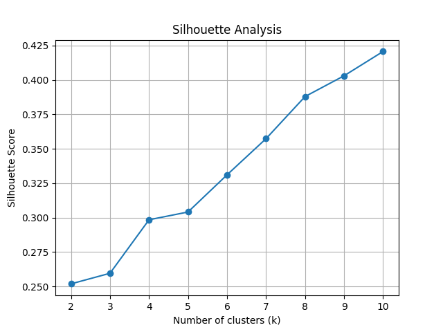

🛍️ Mall Customers Segmentation with K-Means

Internship Project — Customer segmentation using K-Means clustering on mall customer data.  
We identify distinct groups based on demographics and spending patterns, and visualize them using PCA.

---

📌 Objective
To segment mall customers into groups for targeted marketing strategies using unsupervised learning techniques.

---

📂 Dataset
- Source: Mall_Customers.csv (Kaggle)
- Columns:
  - `CustomerID` (Removed for clustering)
  - `Gender` (Encoded: Male = 0, Female = 1)
  - `Age`
  - `Annual Income (k$)`
  - `Spending Score (1-100)`

---
⚙️ Steps Performed

1️⃣ Data Loading & Cleaning
- Loaded dataset and checked structure (`info()`, `head()`).
- Encoded `Gender` into numeric values.
- Dropped `CustomerID`.

2️⃣ Feature Scaling
- Standardized all features using StandardScaler to ensure equal weightage in distance calculation.

3️⃣ Finding Optimal k
- Elbow Method: Plotted inertia for k = 1 to 10.
- Silhouette Analysis: Measured cluster separation for k = 2 to 10.

4️⃣ Model Training
- Selected k = 5(balance between Elbow and Silhouette).
- Trained KMeans with `random_state=42`.

5️⃣ Dimensionality Reduction & Visualization
- Applied PCA (2 components) for 2D visualization.
- Plotted clusters with color coding and red “X” for cluster centers.

---

📊 Results

 Elbow Method

 Silhouette Analysis

 Final Clusters (PCA Visualization)

---

 📈 Observations
- Elbow Method: Suggested optimal k between 5 and 6.
- Silhouette Score: Increased with k but diminishing returns after k=6.
- Final Choice: k=5 for interpretability and separation.

---

🧠 Key Learnings
- Always scale data before K-Means to prevent feature bias.
- Combine Elbow Method (inertia) and Silhouette Score (cluster quality) for k selection.
- Use PCA only for visualization, not for training.

---

📌 Tech Stack
- Python
- Pandas, NumPy
- Matplotlib
- scikit-learn

---

